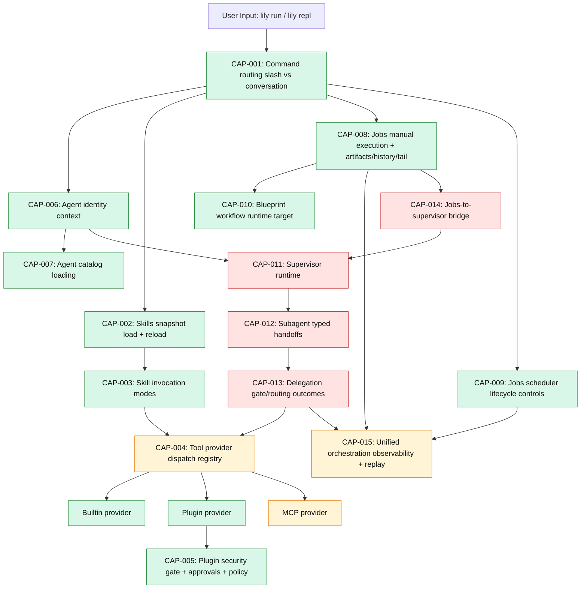

# Lily Capability Flow (Current + Target)

## Read This Diagram

- Green nodes: implemented runtime capability.
- Amber nodes: partially implemented runtime capability.
- Red nodes: missing runtime capability needed for full multi-agent orchestration.

For canonical status and exit criteria, see:
- `docs/dev/references/capability-ledger.md`

## Capability Jump Links

- [CAP-001](../dev/references/capability-ledger.md#cap-001)
- [CAP-002](../dev/references/capability-ledger.md#cap-002)
- [CAP-003](../dev/references/capability-ledger.md#cap-003)
- [CAP-004](../dev/references/capability-ledger.md#cap-004)
- [CAP-005](../dev/references/capability-ledger.md#cap-005)
- [CAP-006](../dev/references/capability-ledger.md#cap-006)
- [CAP-007](../dev/references/capability-ledger.md#cap-007)
- [CAP-008](../dev/references/capability-ledger.md#cap-008)
- [CAP-009](../dev/references/capability-ledger.md#cap-009)
- [CAP-010](../dev/references/capability-ledger.md#cap-010)
- [CAP-011](../dev/references/capability-ledger.md#cap-011)
- [CAP-012](../dev/references/capability-ledger.md#cap-012)
- [CAP-013](../dev/references/capability-ledger.md#cap-013)
- [CAP-014](../dev/references/capability-ledger.md#cap-014)
- [CAP-015](../dev/references/capability-ledger.md#cap-015)
