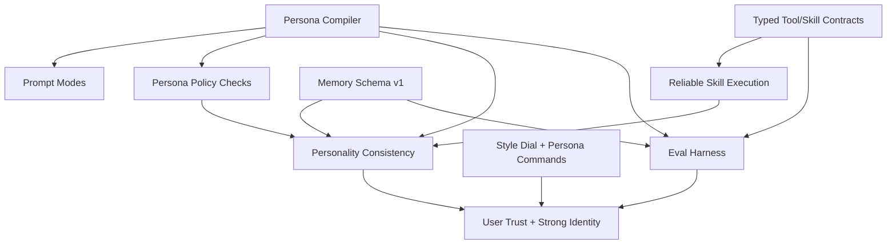
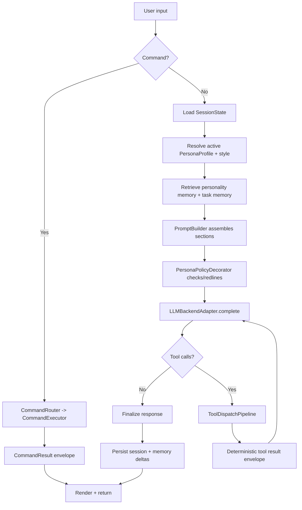
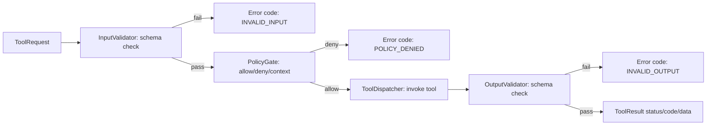
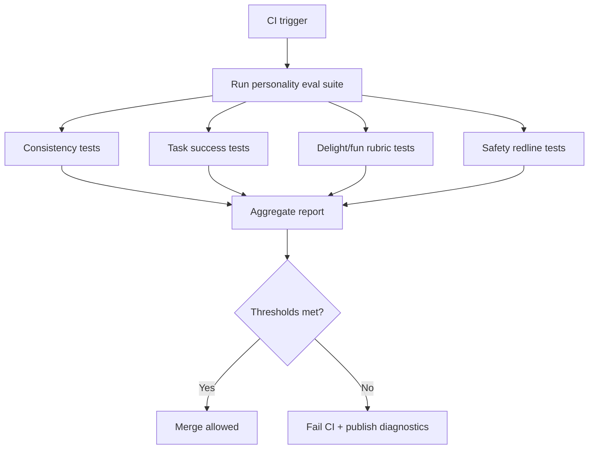

# Lily Personality Roadmap (Strong + Fun)

Purpose: define how Lily’s personality/agent system should evolve, borrowing proven ideas from OpenClaw and broader agent research while improving reliability, control, and delight.

## Inputs Reviewed

- OpenClaw docs + code:
  - `../openclaw/docs/concepts/system-prompt.md`
  - `../openclaw/docs/concepts/agent-workspace.md`
  - `../openclaw/src/agents/system-prompt.ts`
  - `../openclaw/src/agents/workspace.ts`
  - `../openclaw/src/agents/bootstrap-files.ts`
- External references:
  - Anthropic: Building Effective Agents (Dec 19, 2024)
  - OpenAI: Agents SDK + Agent evals docs
  - ReAct (Yao et al., 2022)
  - Generative Agents (Park et al., 2023)
  - Constitutional AI (Bai et al., 2022)
  - InstructGPT (Ouyang et al., 2022)

## What We Borrow From OpenClaw

- Persona/context files are first-class (`AGENTS.md`, `SOUL.md`, `IDENTITY.md`, `USER.md`, `TOOLS.md`, optional memory files).
- Prompt assembly is deterministic and sectioned.
- Sub-agent prompt mode is intentionally smaller than main-agent mode.
- Bootstrap context is bounded/truncated for token safety.
- Skills are discovered as lightweight metadata and loaded on demand.

## How Lily Will Be Better

- Explicit user controls for vibe and behavior (not just hidden prompt files).
- Dual-track memory:
  - personality memory (stable preferences and relationship facts)
  - task memory (project/work continuity)
- Deterministic typed tool/skill interfaces as first-class contracts.
- Personality safety policy that avoids manipulative/over-dependent behavior.
- Dedicated eval suite for personality consistency + task effectiveness + “fun” quality.

## Priority Scale

- `5`: Must-have for first usable personality system
- `4`: High-value next wave
- `3`: Important later
- `2`: Nice enhancement
- `1`: Experimental

## Feature Track (User-Visible)

| Feature | Priority | User story |
|---|---:|---|
| Personality profiles (`/persona list`, `/persona use <name>`) | 5 | “I can pick Lily’s style for this session.” |
| Voice/style dial (`/style focus|balanced|playful`) | 5 | “I can make Lily more concise or more fun on demand.” |
| Relationship memory controls (`/remember`, `/forget`, `/memory show`) | 5 | “Lily remembers me but I control what is kept.” |
| Persona-safe consistency | 5 | “Lily feels like Lily across sessions, not random each turn.” |
| Skill/tool reliability mode (typed I/O errors are clear) | 5 | “Commands fail predictably instead of weirdly.” |
| Persona snapshots (`/persona export` / import) | 4 | “I can share/reuse a tuned persona.” |
| Contextual tone adaptation (work mode vs casual mode) | 4 | “Lily adapts tone to context without losing identity.” |
| Multi-agent personalities (`/agent <name>`) | 3 | “I can switch specialist agents with distinct styles.” |
| Event-driven mood overlays (celebration, coaching, deep focus) | 2 | “Lily can be extra engaging when appropriate.” |
| Generated custom avatars/branding kits | 1 | “Lily has custom visual identity assets.” |

## System Track (Internal Engineering)

| System work | Priority | Why |
|---|---:|---|
| Persona compiler (deterministic prompt assembly from layered inputs) | 5 | Stable behavior and debuggability |
| Prompt modes (`full`, `minimal`) with explicit section toggles | 5 | Cost/perf control and sub-agent safety |
| Personality memory schema (versioned) | 5 | Durable long-term consistency |
| Typed skill/tool contracts (input/output schemas + deterministic validation errors) | 5 | Strong execution reliability |
| Persona policy ruleset + redline checks | 5 | Prevent unsafe/manipulative persona drift |
| Evaluation harness (consistency, utility, delight, safety) | 5 | Prevent regressions before release |
| Persona hot reload (`/reload_persona`) | 4 | Faster iteration |
| Weighted retrieval over persona/task memory | 4 | Better relevance under token limits |
| Auto persona tuning from feedback loops | 2 | Future optimization |

## Dependencies



## Architecture (GoF-Oriented)

### GoF Pattern Mapping

| Area | Pattern | Why |
|---|---|---|
| Prompt assembly | Builder | Compose deterministic prompt sections from layered sources. |
| Persona selection (`/persona use`) | Strategy | Swap persona behavior profile without branching everywhere. |
| Command handling (`/persona`, `/style`, `/remember`) | Command | Uniform command envelope, routing, and undo/audit hooks later. |
| Skill/tool execution | Chain of Responsibility | Validation -> policy -> dispatch -> post-validate pipeline. |
| Persona/safety checks | Decorator | Wrap base generation with policy/redline enforcement. |
| Memory backends | Repository | Isolate storage model from runtime logic (file/sql/vector). |
| Session events (reload, switch, remember) | Observer | Keep UI/logger/eval hooks decoupled from core runtime. |
| Agent runtime facade | Facade | Single entrypoint for REPL/API while hiding subsystem complexity. |
| Component instantiation | Abstract Factory | Build different runtime variants (main, sub-agent, test harness). |

### Class Diagram

```mermaid
classDiagram
  class RuntimeFacade {
    +handleInput(sessionId, input) CommandResult
    +executeTurn(sessionId, userText) TurnResult
  }

  class CommandRouter {
    +route(rawInput) Command
  }

  class CommandExecutor {
    +execute(cmd, sessionCtx) CommandResult
  }

  class PersonaManager {
    +listProfiles() PersonaProfile[]
    +activate(sessionId, profileName) void
    +setStyle(sessionId, style) void
    +snapshot(sessionId) PersonaSnapshot
  }

  class PersonaProfile {
    +name
    +tone
    +constraints
    +styleDefaults
  }

  class PromptBuilder {
    +build(ctx) SystemPrompt
  }

  class PromptSection {
    <<interface>>
    +render(ctx) string
  }

  class BootstrapSection
  class SkillsSection
  class MemorySection
  class RuntimeSection
  class SafetySection

  class PersonaPolicyDecorator {
    +apply(prompt, ctx) SystemPrompt
  }

  class SessionStore {
    +load(sessionId) SessionState
    +save(state) void
  }

  class PersonalityMemoryRepo {
    <<repository>>
    +remember(subject, fact, confidence) MemoryRef
    +forget(memoryId) void
    +query(query, limit) MemoryItem[]
  }

  class TaskMemoryRepo {
    <<repository>>
    +appendEvent(sessionId, event) void
    +query(sessionId, query) MemoryItem[]
  }

  class ToolDispatchPipeline {
    +run(request) ToolResult
  }

  class InputValidator {
    +validate(request) ValidationResult
  }

  class PolicyGate {
    +check(request, sessionCtx) GateResult
  }

  class ToolDispatcher {
    +dispatch(request) ToolResult
  }

  class OutputValidator {
    +validate(result) ValidationResult
  }

  class LLMBackendAdapter {
    +complete(request) LLMResponse
  }

  class EvalHarness {
    +runSuite(suiteName) EvalReport
  }

  class EventBus {
    +publish(event) void
    +subscribe(topic, handler) void
  }

  RuntimeFacade --> CommandRouter
  RuntimeFacade --> CommandExecutor
  RuntimeFacade --> PromptBuilder
  RuntimeFacade --> ToolDispatchPipeline
  RuntimeFacade --> LLMBackendAdapter
  RuntimeFacade --> SessionStore
  RuntimeFacade --> EventBus

  CommandExecutor --> PersonaManager
  CommandExecutor --> PersonalityMemoryRepo
  CommandExecutor --> TaskMemoryRepo

  PromptBuilder o--> PromptSection
  PromptSection <|.. BootstrapSection
  PromptSection <|.. SkillsSection
  PromptSection <|.. MemorySection
  PromptSection <|.. RuntimeSection
  PromptSection <|.. SafetySection
  PromptBuilder --> PersonaPolicyDecorator
  PromptBuilder --> PersonaManager
  PromptBuilder --> PersonalityMemoryRepo
  PromptBuilder --> TaskMemoryRepo

  ToolDispatchPipeline --> InputValidator
  ToolDispatchPipeline --> PolicyGate
  ToolDispatchPipeline --> ToolDispatcher
  ToolDispatchPipeline --> OutputValidator

  EvalHarness --> RuntimeFacade
  EvalHarness --> EventBus
```



### Flowchart: Turn Execution (Main Path)



### Flowchart: Tool Dispatch Pipeline (Deterministic Contract)



### Flowchart: Persona Change + Reload

```mermaid
flowchart TD
  A[/persona use <name>] --> B[CommandExecutor]
  B --> C{Profile exists?}
  C -->|No| X[Return code: PERSONA_NOT_FOUND]
  C -->|Yes| D[PersonaManager.activate]
  D --> E[SessionStore.save active persona]
  E --> F[Publish PersonaChanged event]
  F --> G[Next turn uses new PromptBuilder context]
```

### Flowchart: Memory Write Path (`/remember`)

```mermaid
flowchart TD
  A[/remember fact] --> B[Parse command payload]
  B --> C[Input validation]
  C -->|fail| X[Return deterministic validation error]
  C -->|pass| D[Classify memory namespace]
  D -->|personality| E[PersonalityMemoryRepo.remember]
  D -->|task| F[TaskMemoryRepo.appendEvent]
  E --> G[Persist + index]
  F --> G
  G --> H[Emit MemoryUpdated event]
  H --> I[Return success envelope]
```

### Flowchart: Eval Harness in CI



## Phased Plan (Build Order)

1. Phase 1: Core Runtime Contract (`P5`)
- Implement non-command conversation turn pipeline end-to-end.
- Add `PersonaContext` and `PromptBuilder` interfaces (section-based composition).
- Keep persona command surface minimal during this phase (no broad expansion yet).

2. Phase 2: Architecture Decisions + Safety Boundaries (`P5`)
- Freeze memory ADR:
  - dual-store (`personality` + `task`) vs unified namespaced store
  - retrieval contract
  - retention/deletion semantics
- Add policy precedence contract:
  - `safety > user style > persona default > stochastic expression`
- Add pre-LLM and post-LLM policy checks.

3. Phase 3: Usable Personality Controls (`P5`)
- Add `/persona list|use|show`.
- Add `/style` dial with `focus|balanced|playful`.
- Add `/remember`, `/forget`, `/memory show`.

4. Phase 4: Strong Execution Contracts (`P5`)
- Enforce typed skill/tool I/O contracts in runtime path.
- Return deterministic error envelope for validation failures.
- Add conformance tests for at least 3 skills.

5. Phase 5: Quality Gates + Expansion (`P5` then `P4+`)
- Eval suite:
  - consistency across restarts
  - task success with persona enabled
  - fun/engagement rubric scoring
  - safety redline pass rate
- Then add `/reload_persona`, persona export/import, contextual tone adaptation.
- Multi-agent personalities when agent subsystem is ready.

## Architecture Gates (Must Pass Before Next Phase)

- Gate A (before Phase 3 command expansion):
  - conversation turn path implemented
  - `PersonaContext` + `PromptBuilder` interfaces stable
  - memory ADR approved
  - policy precedence contract approved

- Gate B (before Phase 5 expansion):
  - typed tool/skill validation in place
  - deterministic error envelopes verified
  - baseline eval set (10-20 canonical cases) passing target thresholds

## Acceptance Criteria For “Up To Snuff”

- Personality remains consistent across 10+ session restarts.
- User can switch persona/style in-session with deterministic outcomes.
- At least 90% pass rate on personality consistency eval set.
- Typed skill/tool validation errors are deterministic and machine-readable.
- Safety redline suite has zero critical failures in CI.

## Open Design Decisions

- Should persona changes be session-local by default, with explicit “save globally”?
- Should playful style be disabled automatically for high-risk domains (medical/legal/financial)?
- Should personality memory and task memory live in separate stores or one store with typed namespaces?

## Locked Decisions

- Conversation/tool loop limit configuration uses explicit boolean enablement for clarity.
- Preferred config shape:
  - `enabled: true|false`
  - value fields such as `max_rounds`, `timeout_ms`, `max_retries`
- Default baseline values:
  - `tool_loop.enabled: false`, `tool_loop.max_rounds: 8`
  - `timeout.enabled: false`, `timeout.timeout_ms: 30000`
  - `retries.enabled: true`, `retries.max_retries: 1`
- Sentinel values (`-1`, `0`) are not the primary user-facing UX pattern.

## Source Links

- https://www.anthropic.com/engineering/building-effective-agents
- https://developers.openai.com/api/docs/guides/agents-sdk
- https://developers.openai.com/api/docs/guides/agent-evals
- https://arxiv.org/abs/2210.03629
- https://arxiv.org/abs/2304.03442
- https://www.anthropic.com/research/constitutional-ai-harmlessness-from-ai-feedback
- https://arxiv.org/abs/2203.02155
