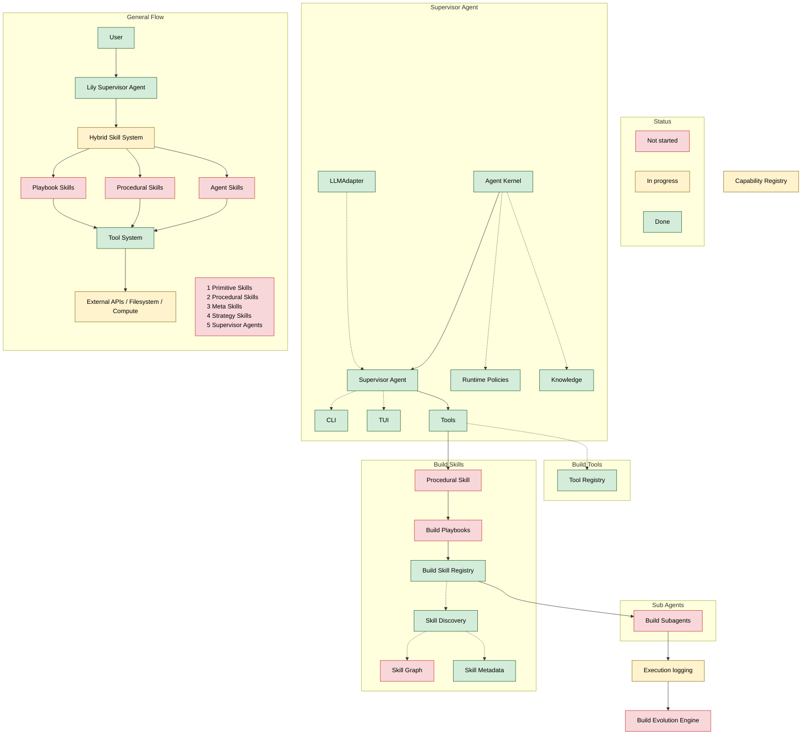

```mermaid
flowchart TB
    
    %% Named status styles: use "class node_id not_started|in_progress|done" to set a node's color
    classDef not_started fill:#f8d7da,stroke:#c92a2a,color:#000
    classDef in_progress fill:#fff3cd,stroke:#856404,color:#000
    classDef done fill:#d4edda,stroke:#155724,color:#000

    subgraph status_legend[Status]
        _not_started[Not started]
        _in_progress[In progress]
        _done[Done]
    end
    class _not_started not_started
    class _in_progress in_progress
    class _done done

    evolution[Build Evolution Engine]
    logging[Execution logging]
    capability_registry[Capability Registry]
    
    
    subgraph supervisor_agent[Supervisor Agent]
        kernel[Agent Kernel] 
        llmadapter[LLMAdapter]
        supervisor[Supervisor Agent]
        runtime_policies[Runtime Policies]
        knowledge[Knowledge]
        cli[CLI]
        tui[TUI]

        kernel -.-> runtime_policies
        kernel --> supervisor --> tools
        llmadapter -.-> supervisor
        kernel -.-> knowledge

    end

    subgraph build_tools[Build Tools]
        tools[Tools]
        tool_registry[Tool Registry]

        tools -.-> tool_registry
    end
    

    subgraph build_skills[Build Skills]
        procedural_skill[Procedural Skill]
        playbooks[Build Playbooks]
        registry[Build Skill Registry]
        skill_discovery[Skill Discovery]
        skill_graph[Skill Graph]
        skill_metadata[Skill Metadata]

        registry -.-> skill_discovery
        skill_discovery -.-> skill_graph
        skill_discovery -.-> skill_metadata
        playbooks --> registry
        
        supervisor -.-> cli
        supervisor -.-> tui        
    end
    

    subgraph sub_agents[Sub Agents]
        subagents[Build Subagents]
    end

    subgraph flow[General Flow]
        direction TB
        luser[User]
        lsa[Lily Supervisor Agent]
        lhs[Hybrid Skill System]
        lps[Playbook Skills]
        lprs[Procedural Skills]
        las[Agent Skills]
        lts[Tool System]
        lea[External APIs / Filesystem / Compute]

        skill_levels["1 Primitive Skills<br/>2 Procedural Skills<br/>3 Meta Skills<br/>4 Strategy Skills<br/>5 Supervisor Agents"]
        style skill_levels text-align:left

        luser --> lsa --> lhs
        lhs --> lps --> lts
        lhs --> lprs --> lts
        lhs --> las --> lts
        lts --> lea
        %% lhs -.-> skill_levels

    end


    registry --> subagents
    subagents --> logging

    tools --> procedural_skill

    procedural_skill --> playbooks

    logging --> evolution

    %% --- Status: change a node by setting its class to not_started | in_progress | done ---
    class evolution not_started
    class logging in_progress
    class capability_registry in_progress
    class kernel done
    class llmadapter done
    class supervisor done
    class runtime_policies done
    class knowledge done
    class cli done
    class tui done
    class tools done
    class tool_registry done
    class procedural_skill not_started
    class playbooks not_started
    class registry done
    class skill_discovery done
    class skill_graph not_started
    class skill_metadata done
    class subagents not_started
    class luser done
    class lsa done
    class lhs in_progress
    class lps not_started
    class lprs not_started
    class las not_started
    class lts done
    class lea in_progress
    class skill_levels not_started

```
<!-- Status: class node_id not_started|in_progress|done -->
