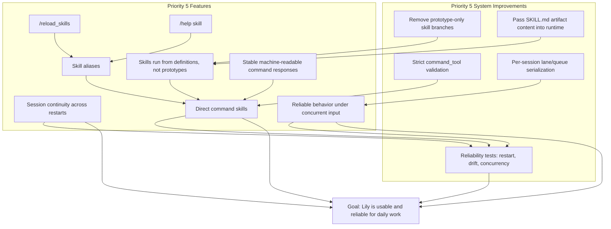

# Lily Roadmap (Guiding Light)

Purpose: define what we build, in what order, and why.

This roadmap is the source of truth for prioritization.
If something is not on this list (or not promoted on this list), we do not build it yet.
Debt tracking lives in `docs/dev/debt_tracker.md`.
Live weekly execution status lives in `docs/dev/status.md`.

Status snapshot (2026-02-17):
- The original core hardening phases in this roadmap are complete.
- Current active work should be selected from `docs/dev/debt_tracker.md` and domain plans.

## Priority Scale

- `5` = Must have for usable Lily (build now)
- `4` = High value, build soon after core is stable
- `3` = Important, but can wait
- `2` = Nice improvement
- `1` = Interesting idea, optional/experimental

## Core Rule

We focus on `5` features first until Lily is reliably usable for real work.
No `4/3/2/1` feature should preempt unfinished `5` work unless it unblocks a `5`.

## Dependency Map (Good-Place First)

Recommended critical path to "good place":
1. `F2`, `F3`, `F7` (core command usability)
2. `S1`, `S2` -> `F6` (real skill execution)
3. `F4` -> `S3` -> `F5` (deterministic direct commands)
4. `S4` -> `F8` (concurrency reliability)
5. `F1` + `S5` (restart continuity + confidence gates)

## User Stories (Features List)

| User story | Priority | Why it matters |
|---|---:|---|
| As a user, I can continue my session after restart without losing context. | 5 | Daily usability and trust |
| As a user, I can run `/reload_skills` to refresh available skills when I choose. | 5 | Explicit, deterministic control |
| As a user, I can run `/help <skill>` to understand what a skill does before using it. | 5 | Discoverability and confidence |
| As a user, I can invoke common skills by short aliases like `/plan`. | 5 | Faster workflows |
| As a user, I can trigger direct command skills for high-confidence actions. | 5 | Deterministic operations |
| As a user, adding a new skill actually works without hidden hardcoded behavior. | 5 | Real extensibility |
| As a user, command responses are stable and machine-readable. | 5 | Predictable UX + automation |
| As a user, multiple incoming actions do not create inconsistent results. | 5 | Reliability under load |
| As a user, I can switch active persona/agent with `/agent <name>`. | 4 | Multi-agent workflows |
| As a user, I can use my own personal skills in addition to workspace and bundled skills. | 4 | Better customization |
| As a user, I get clear reasons when a skill is malformed or unavailable. | 4 | Better debugging and trust |
| As a user, I can inspect run diagnostics/traces when something goes wrong. | 4 | Troubleshooting support |
| As a user, skills can define typed inputs/outputs so behavior is more deterministic. | 4 | Higher-quality contracts |
| As a user, skill changes are detected quickly with a clear refresh signal. | 3 | Faster iteration |
| As a user, unknown commands can offer safe suggestions (without auto-running anything). | 2 | Better UX |
| As a user, I can reload persona files without restarting (`/reload_persona`). | 2 | Convenience |
| As a user, I can validate/lint skills before running them. | 2 | Fewer runtime surprises |
| As a user, I can view replay artifacts for debugging. | 2 | Post-run analysis |
| As a user, I can install skills from external plugins/registry. | 1 | Ecosystem expansion |
| As a user, Lily can evolve into multi-channel routing/platform capabilities. | 1 | Long-term expansion |

## Focused Build Order (Only Priority 5)

### Phase A: Usable Core Commands

1. `/reload_skills`
2. `/help <skill>`
3. stable machine-readable command responses
4. skill aliases
5. direct command skills (deterministic)

Exit criteria:
- deterministic command behavior
- deterministic errors
- no silent fallback
- aliases and direct command skills fully tested

### Phase B: Real Skill Usability

1. ensure skills run from their own definitions
2. validate at least two non-prototype skills end-to-end
3. keep both orchestration and direct-command skill paths consistent

Exit criteria:
- no prototype-only behavior paths in runtime
- at least 2 non-prototype skills work through shared contract

### Phase C: Reliability for Daily Use

1. session persistence and reload semantics
2. reliable per-session concurrency behavior
3. restart + drift + concurrency reliability validation

Exit criteria:
- process restart preserves session + snapshot as specified
- concurrent inputs do not corrupt or reorder session state unexpectedly
- reliability tests are green

### Phase D: Deterministic Skill Contracts (Priority-4 Elevation)

1. add optional typed I/O schema fields to skill metadata/contracts
2. validate input before execution and output before returning
3. add contract tests for schema violations and stable error behavior

Exit criteria:
- typed skills fail fast with deterministic validation errors
- tool_dispatch and llm_orchestration both support typed contract checks
- at least 2 skills use typed I/O end-to-end

## What We Build Right Now

Current active target: **Debt-driven follow-through and next-phase features**.

Execution rule:
- use `docs/dev/debt_tracker.md` for active open engineering debt
- use domain execution plans for phase work (for example memory/personality plans)
- keep this roadmap focused on priority and ordering, not checkbox status

## Planned Feature Tracks (Post-Core)

- [ ] Real agent subsystem + `/agent` migration (Priority 4)
  - Build an explicit agent registry/state model (not persona-compat mode).
  - Rebind `/agent list|use|show` to real agent entities.
  - Define deterministic migration behavior from current persona-backed commands.
  - Add command + REPL coverage for registry/list/show/use flows.

## System Improvements (Internal Work)

These are not user-facing features. They are required to make Lily robust.

| Improvement | Priority | Enables |
|---|---:|---|
| Remove skill-specific prototype branches (for example `echo` special-casing). | 5 | Real extensibility from skill files |
| Pass skill artifact content (`SKILL.md`) into execution paths. | 5 | Skill-driven behavior |
| Implement strict `command_tool` validation for direct command skills. | 5 | Deterministic/safe command execution |
| Add per-session lane/queue serialization primitives. | 5 | Reliable concurrent behavior |
| Add restart, snapshot drift, and concurrency reliability tests. | 5 | Confidence in core stability |
| Session persistence schema versioning and migration stubs. | 4 | Safe evolution over time |
| Structured loader/command/executor trace events. | 4 | Operability and debugging |
| File-locking strategy for multi-process persistence safety. | 3 | Correctness in advanced deployments |

## How We Use This Document

For every new task:
1. Map it to a feature in this table.
2. If it is not mapped, add it with a priority before implementation.
3. If its priority is lower than unfinished `5` work, it waits.
4. If we change a priority, update this document in the same PR.

## Change Log

- 2026-02-14: Initial roadmap created as execution guide after Agent Mode v0 completion.
- 2026-02-17: Pruned status ownership; active execution status moved to debt/domain plan docs.
- 2026-02-21: Moved real `/agent` work from debt tracker into planned feature tracks.
