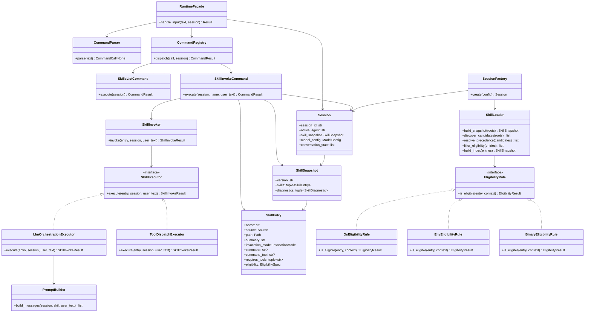
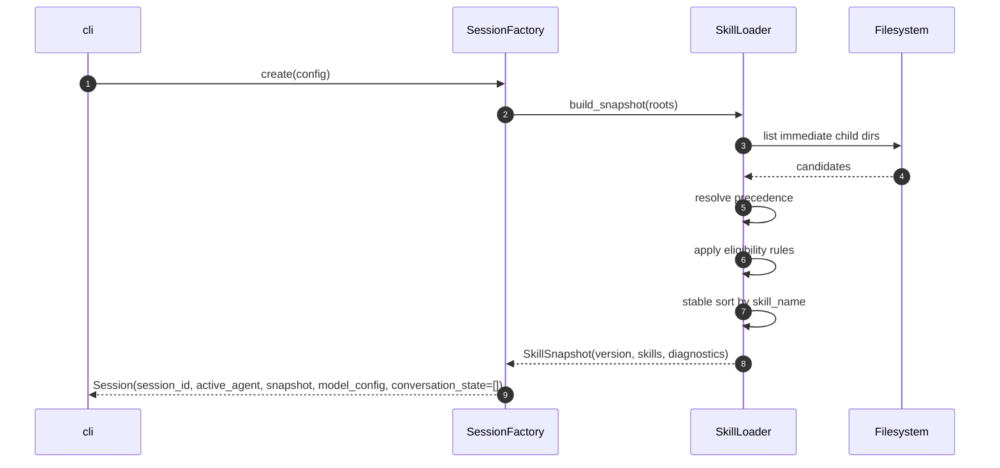
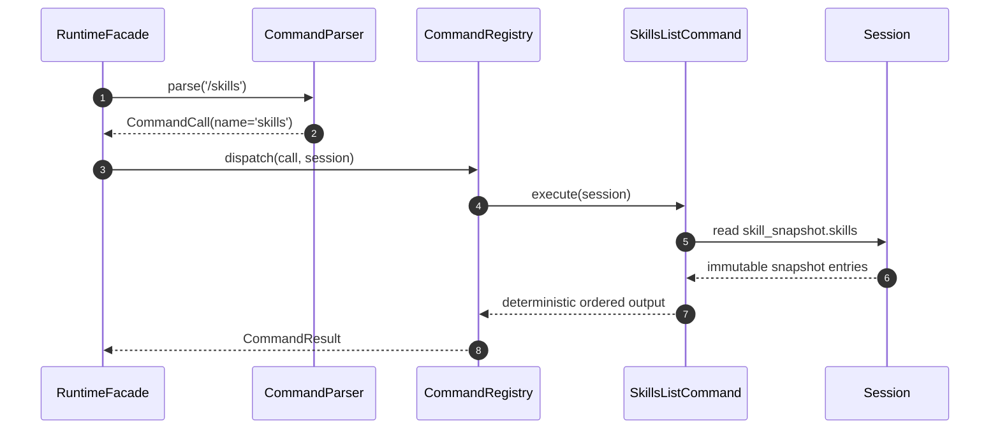
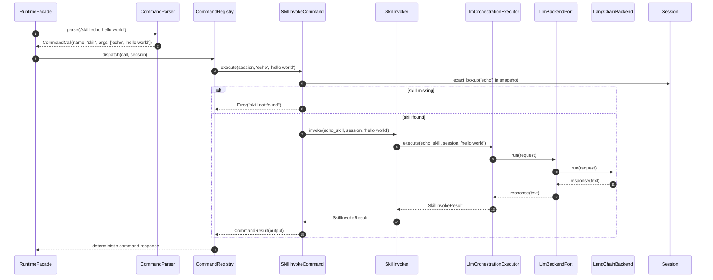
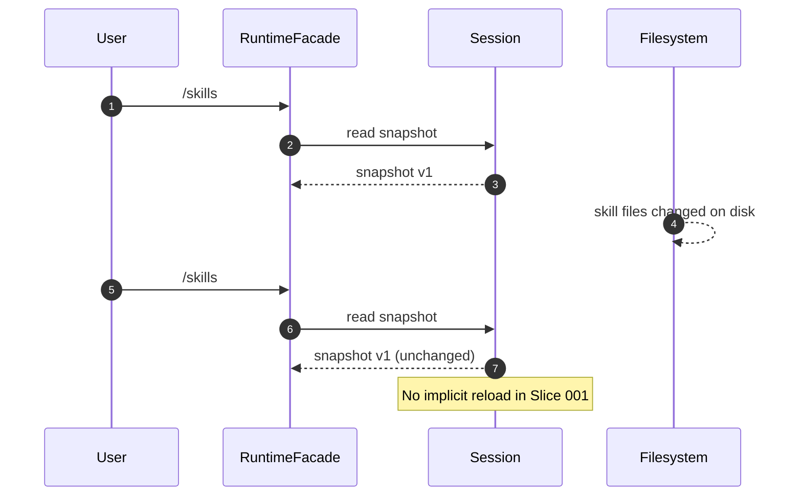
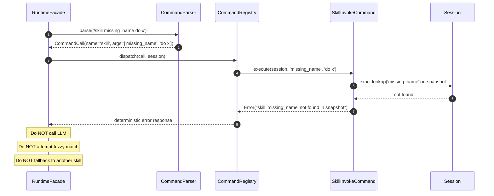

# Slice 001 Implementation Design Plan (GoF-Oriented)

## Purpose

Define the smallest end-to-end Lily slice that proves the v0 contracts are coherent:

`load -> snapshot -> /skills -> /skill <name> -> execute one skill`

This document is implementation-facing. It uses GoF language to keep boundaries explicit.

---

## Slice Scope

### In Scope

- Deterministic skills loader (bundled + workspace roots)
- Precedence resolution: `workspace > bundled` (user root may be added later)
- Eligibility filtering
- Immutable session skill snapshot
- Deterministic commands:
  - `/skills`
  - `/skill <name>`
- One bundled skill (`echo`) in `llm_orchestration` mode

### Out of Scope (for this slice)

- `/reload_skills`, `/agent`, `/help`
- Skill alias commands (`/plan` style)
- Watchers / auto-reload
- Multi-agent orchestration
- Sandbox and advanced tool policy
- Background lanes
- TUI interface (deferred; CLI grammar only in this slice)

---

## Design Constraints (from specs)

- Command path must never depend on LLM routing.
- Skill resolution must be snapshot-based, not live filesystem-based mid-session.
- Exact match only for `/skill <name>`.
- No silent fallback (name, precedence, or eligibility).
- Deterministic ordering for `/skills` output.

---

## CLI Form And Tooling Conventions

### CLI Form (Slice 001)

- Primary interface: REPL CLI.
- Secondary interface: single-shot mode (`run` style invocation) for tests/automation.
- Slash commands are input grammar, not a UI type.
- No TUI in Slice 001.

### Implementation Conventions

- CLI framework: **Typer**.
- Console/log output: **Rich** (consistent styled logs and command output).
- Keep runtime and command engine UI-agnostic so a future TUI can wrap the same core.

---

## GoF Pattern Map

### 1. **Template Method** for Loader Pipeline

Use a fixed algorithm skeleton for building a snapshot:

1. discover candidates
2. resolve precedence
3. filter by eligibility
4. sort deterministically
5. build snapshot

Why: enforces contract order and prevents accidental phase inversion.

### 2. **Strategy** for Eligibility Rules

Eligibility checks (`os`, `env`, `binaries`) are separate strategies implementing a shared interface.

Why: keeps loader core deterministic and testable while allowing rules to evolve independently.

### 3. **Factory Method** for Session Bootstrap

`SessionFactory.create(...)` constructs a fully valid session with an already-built snapshot.

Why: ensures no partially initialized session objects and centralizes invariants.

### 4. **Command** for Deterministic Slash Commands

Each slash command handler is a Command object (or equivalent callable object):

- `SkillsListCommand`
- `SkillInvokeCommand`

Why: deterministic dispatch table, no LLM involvement, easy extension later.
`SkillInvokeCommand` coordinates only; it delegates execution.

### 5. **Facade** for Runtime Entry

`RuntimeFacade.handle_input(text, session)` routes to:

- command subsystem if prefixed `/`
- conversational subsystem otherwise

Why: single boundary for deterministic vs probabilistic paths.

### 6. **Value Object** style Snapshot (immutable semantics)

`SkillSnapshot` treated as immutable after session creation for this slice.

Why: prevents drift and accidental mutation.

### 7. **Strategy** for Skill Execution

Use an explicit execution seam:

- `SkillInvoker` orchestration service
- `SkillExecutor` interface
- concrete executors by mode (`LlmOrchestrationExecutor`, `ToolDispatchExecutor`)

Why: keeps command handlers thin and enables future remote/sandboxed execution without command-layer rewrites.

### 8. **Adapter** for Hidden LLM Runtime Integration

Keep third-party LLM orchestration (LangChain v1) behind an internal adapter boundary:

- `runtime.llm_backend.base`: Lily-owned backend protocol + request/response models
- `runtime.llm_backend.langchain_adapter`: concrete LangChain v1 implementation
- `runtime.executors.llm_orchestration`: depends only on Lily backend protocol

Why: isolates framework churn and prevents LangChain details from leaking into command/session/skills layers.

---

## Proposed Package Layout

```text
src/lily/
  cli/
    cli.py
  runtime/
    facade.py
  session/
    models.py
    factory.py
  skills/
    types.py
    frontmatter.py
    discover.py
    precedence.py
    eligibility.py
    loader.py
  commands/
    parser.py
    registry.py
    handlers/
      skills_list.py
      skill_invoke.py
  prompting/
    prompt_builder.py
```

---

## Core Types (Draft)

```python
from pydantic import BaseModel, ConfigDict, Field
from enum import Enum

class SkillSource(str, Enum):
    BUNDLED = "bundled"
    WORKSPACE = "workspace"
    USER = "user"

class InvocationMode(str, Enum):
    LLM_ORCHESTRATION = "llm_orchestration"
    TOOL_DISPATCH = "tool_dispatch"

class SkillEntry(BaseModel):
    model_config = ConfigDict(frozen=True)
    name: str
    source: SkillSource
    path: Path
    summary: str
    invocation_mode: InvocationMode
    command: str | None = None
    command_tool: str | None = None
    requires_tools: tuple[str, ...] = ()
    eligibility: EligibilitySpec

class SkillSnapshot(BaseModel):
    model_config = ConfigDict(frozen=True)
    version: str
    skills: tuple[SkillEntry, ...]
    diagnostics: tuple[SkillDiagnostic, ...] = ()

class Session(BaseModel):
    session_id: str
    active_agent: str
    skill_snapshot: SkillSnapshot
    model_config: ModelConfig
    conversation_state: list[Message] = Field(default_factory=list)
```

---

## Execution Flow (Clean Boundary)

### Boot

1. Load persona files (fixed for session)
2. Build skill snapshot via loader Template Method
3. Create session via SessionFactory

### Turn Handling

1. Input text received
2. If text starts with `/`:
   - parse command deterministically
   - execute command object
   - return result
3. Else:
   - conversational path (LLM path, can be minimal/stub for this slice)

### `/skill <name>` Flow

1. Exact lookup in `session.skill_snapshot.skills`
2. If missing: explicit error
3. If found: delegate to `SkillInvoker`
4. `SkillInvoker` selects executor by `invocation_mode`
5. `LlmOrchestrationExecutor` calls private `LlmBackend` port
6. `LangChainBackend` (internal adapter) executes workflow
7. Executor returns structured result
8. Return deterministic observable result

---

## Module Responsibilities

- `skills.loader`: orchestrates snapshot build pipeline
- `skills.discover`: immediate-child directory discovery + `SKILL.md` presence
- `skills.precedence`: deterministic winner selection by source rank
- `skills.eligibility`: rule evaluation strategies
- `commands.parser`: strict slash parsing, no fuzzy behavior
- `commands.registry`: command-name -> command-object mapping
- `commands.handlers.skill_invoke`: coordination only (validate + lookup + delegate)
- `runtime.skill_invoker`: orchestration service for invoking resolved skills
- `runtime.executors.base`: `SkillExecutor` interface
- `runtime.executors.llm_orchestration`: LLM-orchestrated execution strategy
- `runtime.executors.tool_dispatch`: deterministic tool-dispatch strategy (future slice)
- `runtime.llm_backend.*`: private LLM backend boundary (LangChain implementation hidden here)
- `session.factory`: creates valid session state
- `runtime.facade`: one entry point for deterministic/probabilistic routing

---

## Milestones

### Milestone A: Loader + Snapshot

- Parse `SKILL.md` frontmatter/body
- Discover from bundled/workspace
- Resolve precedence deterministically
- Apply eligibility filters
- Return stable sorted snapshot

### Milestone B: Session Factory

- Build session with immutable snapshot
- Ensure snapshot remains unchanged during turn handling

### Milestone C: Command Surface (2 commands)

- `/skills` returns snapshot list in deterministic order
- `/skill <name>` exact-match invoke + explicit failures

### Milestone D: Echo Skill Proof

- Add bundled `echo/SKILL.md`
- Verify forced invocation path end-to-end

---

## Test Plan (Contract-Level)

- `test_loader_precedence_workspace_over_bundled`
- `test_loader_no_fallback_when_high_precedence_ineligible`
- `test_snapshot_is_stable_after_filesystem_change`
- `test_skills_command_uses_snapshot_only`
- `test_skill_command_exact_match_only`
- `test_skill_command_no_fallback`
- `test_echo_skill_forced_invocation`

---

## Key Risks and Mitigations

- **Risk:** Hidden live filesystem reads during command execution.
  - **Mitigation:** command handlers consume snapshot only.
- **Risk:** Nondeterministic ordering from filesystem APIs.
  - **Mitigation:** explicit sorted ordering at each phase boundary.
- **Risk:** Ambiguous precedence handling.
  - **Mitigation:** centralized precedence resolver + deterministic tests.

---

## Definition of Slice Completion

Slice 001 is complete when:

- snapshot build is deterministic
- session stores and uses snapshot immutably
- `/skills` and `/skill <name>` are deterministic and snapshot-only
- `echo` proves end-to-end forced invocation
- no silent fallback exists anywhere in this slice

## Implementation Notes (Slice Close)

- LLM backend seam is implemented with LangChain v1 in `runtime.llm_backend.langchain_adapter`.
- Echo deterministic behavior is currently enforced by a temporary backend branch and is tracked for removal in backlog.
- See `deviations.md` for full rationale and follow-up actions.

---

## UML Diagrams (Mermaid)

### Class Diagram



### Sequence Diagram: Session Boot



### Sequence Diagram: `/skills`



### Sequence Diagram: `/skill echo` (llm_orchestration)



### Sequence Diagram: Snapshot Stability Guarantee



### Sequence Diagram: `/skill missing_name` (Explicit No-Fallback Error)


