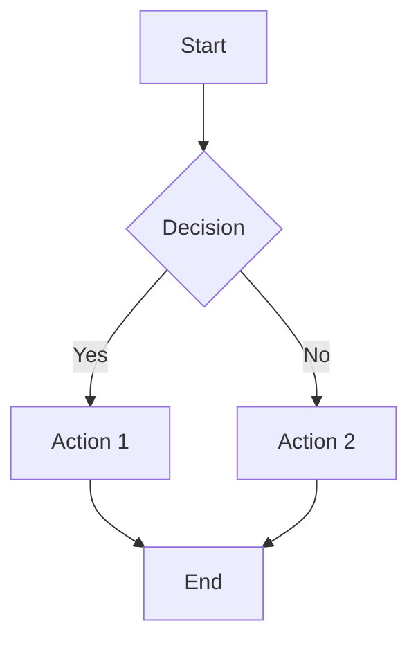
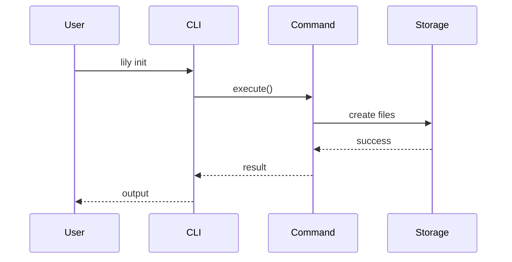
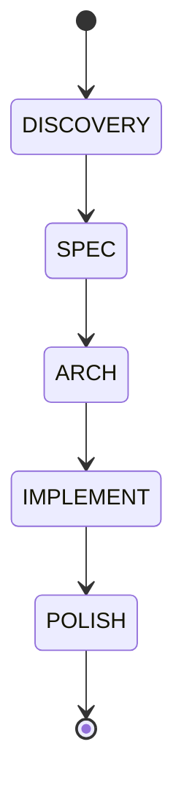

# Mermaid Diagram Test

This page tests Mermaid diagram rendering in the documentation site.

## Flowchart Example

## Sequence Diagram Example

## State Diagram Example

These diagrams should render correctly if Mermaid plugin is configured properly.

