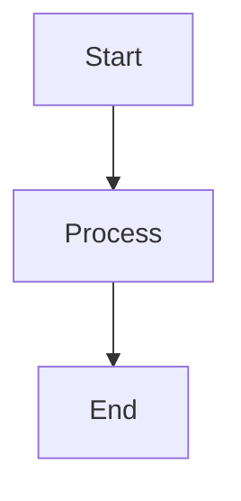

# Quickstart: Documentation Site Infrastructure

**Feature**: Documentation Site Infrastructure  
**Date**: 2026-01-15

## Overview

This quickstart guide explains how to set up and use the MkDocs documentation site infrastructure for the Lily project.

## Prerequisites

- Python 3.13+ installed
- `uv` package manager installed
- Project dependencies synced

## Setup Steps

### 1. Install Documentation Dependencies

```bash
uv sync --group docs
```

This installs:
- `mkdocs` - Documentation site generator
- `mkdocs-material` - Material theme for MkDocs
- `mkdocs-mermaid2-plugin` - Mermaid diagram support

### 2. Verify Configuration

Ensure `mkdocs.yml` exists at project root with proper configuration (see contracts/mkdocs-config.md for details).

### 3. Organize Documentation

Ensure `docs/` directory exists with:
- `index.md` - Site homepage
- `specs/` - Specifications directory (can link to root specs/)
- `ideas/` - Ideas directory (can link to root ideas/)
- Any other documentation files

### 4. Test Local Development Server

```bash
just docs-serve
```

Open http://127.0.0.1:8000 in your browser. You should see:
- Site homepage
- Sidebar navigation
- Search functionality
- Dark mode toggle

### 5. Build Static Site

```bash
just docs-build
```

This generates the static site in `site/` directory, ready for deployment.

## Common Workflows

### Adding New Documentation

1. Create or edit Markdown file in `docs/` directory
2. If using `just docs-serve`, changes appear automatically
3. If building manually, run `just docs-build` after changes

### Adding Mermaid Diagrams

In any Markdown file, use code blocks with `mermaid` language:

````markdown

````

### Customizing Navigation

Edit `mkdocs.yml` and add/update the `nav` section:

```yaml
nav:
  - Home: index.md
  - Specs: specs/
  - Ideas: ideas/
  - New Section: new-section.md
```

### Deploying to GitHub Pages

**Option 1: Using mkdocs gh-deploy**
```bash
uv run mkdocs gh-deploy
```

**Option 2: Manual Deployment**
1. Run `just docs-build`
2. Copy contents of `site/` to `gh-pages` branch
3. Push to GitHub

## Troubleshooting

### "mkdocs: command not found"

**Solution**: Run `uv sync --group docs` to install dependencies

### "Configuration file not found"

**Solution**: Ensure `mkdocs.yml` exists at project root

### "docs/ directory not found"

**Solution**: Create `docs/` directory with at least `index.md`

### Site not updating after file changes

**Solution**: 
- Check that `just docs-serve` is running
- Verify file is saved
- Check browser console for errors

### Mermaid diagrams not rendering

**Solution**:
- Verify `mkdocs-mermaid2-plugin` is installed
- Check that plugin is listed in `mkdocs.yml` plugins section
- Ensure diagram syntax is correct

## Next Steps

- Review [mkdocs.yml configuration contract](./contracts/mkdocs-config.md)
- Review [justfile targets contract](./contracts/justfile-targets.md)
- See [data model](./data-model.md) for structure details
- Check [research](./research.md) for design decisions
