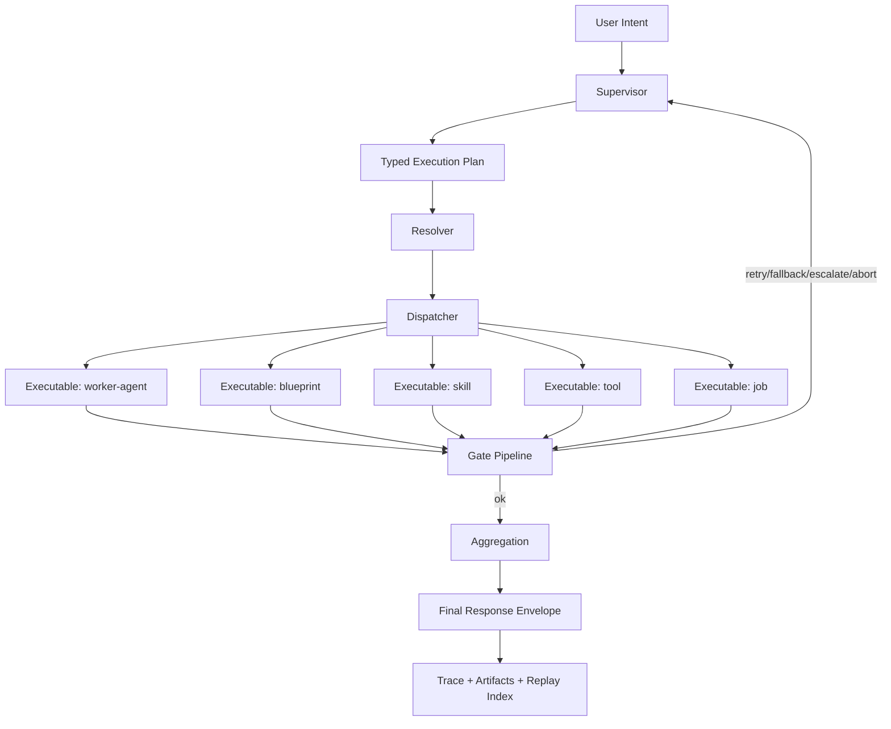

# Executable Orchestration Architecture V1

Status: Active  
Date: 2026-03-04  
Scope: canonical architecture contract for supervisor-led orchestration over executables (`agent`, `blueprint`, `skill`, `tool`, `job`) using deterministic runtime boundaries.

## 1. Why This Spec Exists

Lily currently has strong subsystem capability (skills, agents identity context, jobs, blueprints) but lacks a single orchestration contract for how these parts compose into one coherent execution model.

This spec is the execution constitution for that composition.

Related docs:
- `docs/dev/references/capability-ledger.md`
- `docs/diagrams/lily-capability-flow.md`
- `docs/specs/agents/supervisor_subagents_v1.md`
- `docs/specs/runtime/runtime_architecture_v1.md`

## 2. Scope

In scope:
- common invocation envelopes for all executable calls.
- supervisor plan, delegation, gate decisions, aggregation.
- resolver + dispatcher architecture.
- authority model (identity inheritance + policy checks).
- observability/replay contract.
- sync vs async execution semantics.
- GoF patterns and enforcement rules.

Out of scope:
- UI/Studio work.
- autonomous recursive agents.
- distributed scheduler orchestration.
- non-deterministic planner loops in V1.

## 3. Target Outcome

Lily must support one runtime path where:
1. User intent is accepted.
2. Supervisor decides execution plan.
3. Plan steps call any executable type through one contract.
4. Gate results drive `ok/retry/fallback/escalate/abort`.
5. Supervisor returns one deterministic final response.
6. Full trace and artifacts are persisted.

## 4. Core Concepts

- `Supervisor`: top-level orchestration authority for one run.
- `Worker Agent`: delegated execution target for scoped tasks.
- `Executable`: any callable runtime target (`agent`, `blueprint`, `skill`, `tool`, `job`).
- `Resolver`: maps intent/target reference to executable kind + handler binding.
- `Dispatcher`: invokes resolved executable through common contract.
- `Gate`: deterministic policy/quality/security decision step.
- `Aggregation`: combine multiple step outcomes into final response envelope.
- `Trace`: immutable run-step history for audit/replay.

## 5. Architecture Topology



## 6. Shared Execution Contract

All executable calls must traverse these canonical envelopes.

### 6.1 Executable Reference

```yaml
ExecutableRef:
  executable_id: string          # stable target id (example: "nightly_security_council")
  executable_kind: string|null   # optional hint; resolver is source of truth
  version: string|null
```

### 6.2 Executable Request

```yaml
ExecutableRequest:
  run_id: string
  step_id: string
  parent_step_id: string|null
  caller:                        # authority context
    supervisor_id: string
    active_agent: string
  target: ExecutableRef
  objective: string
  input: object
  context:
    memory_refs: [string]
    artifact_refs: [string]
    constraints:
      timeout_ms: int|null
      retry_budget: int|null
      cost_budget: number|null
  metadata:
    trace_tags: object
    created_at_utc: string
```

### 6.3 Executable Result

```yaml
ExecutableResult:
  run_id: string
  step_id: string
  status: "ok"|"error"|"deferred"
  output: object
  references: [string]
  artifacts: [string]
  metrics:
    duration_ms: int
  error:                         # present when status != ok
    code: string
    message: string
    retryable: bool
    data: object
```

### 6.4 Gate Decision

```yaml
GateDecision:
  run_id: string
  step_id: string
  outcome: "ok"|"retry"|"fallback"|"escalate"|"abort"
  reason_code: string
  reason_message: string
  next_step_hint: string|null
```

## 7. Resolution Contract

Caller does not pick implementation mechanics.

Rules:
1. Supervisor/planner should interpret user intent and, when confident, produce explicit target ids before resolver binding.
2. Caller supplies objective + optional target hint.
3. Resolver determines final `executable_kind` and bound handler.
4. Resolver output is deterministic for same input/context.
5. Executable ids are unique in resolver scope; duplicate-id collisions are deterministic ambiguity failures.
6. Hints remain supported for non-supervisor callers and partial-target call paths.
7. Resolution failure returns deterministic envelope (`resolver_unresolved`, `resolver_ambiguous`, etc).

## 8. Dispatcher Contract

Dispatcher is registry-driven, not `if/elif` driven.

Interface contract:
- `dispatch(request: ExecutableRequest) -> ExecutableResult`

Registry contract:
- key: `ExecutableKind`
- value: `ExecutableHandler`

Each handler must implement:
1. input validation.
2. bounded execution.
3. output normalization to `ExecutableResult`.
4. deterministic error mapping.

## 9. Authority Model

1. Supervisor is the only delegator in V1.
2. Subagents do not recursively delegate in V1.
3. Delegated calls inherit supervisor authority by default.
4. Scoped override is allowed only by explicit policy contract.
5. Skills/tools/blueprints/jobs must receive caller context in request envelope.
6. Policy checks are deny-by-default when required fields are missing.

## 10. Gate Model

Gate pipeline order for V1:
1. contract integrity gate.
2. capability/policy gate.
3. security gate.
4. quality/routing gate.

Outcome semantics:
- `ok`: continue plan.
- `retry`: rerun same step with bounded budget.
- `fallback`: route to alternate target/strategy.
- `escalate`: request supervisor decision branch.
- `abort`: terminate run with explicit error envelope.

## 11. Sync vs Async Execution Rules

Synchronous path:
- `skill`, `tool`, most `worker-agent`, immediate blueprint calls.

Asynchronous path:
- long-running or scheduled workloads via `job`.

Rules:
1. Sync calls return direct `ExecutableResult`.
2. Async dispatch returns immediate accepted/deferred envelope with run reference.
3. Async completion must still emit canonical `ExecutableResult` for trace convergence.

## 12. Aggregation Contract

Supervisor aggregation must:
1. consume only typed step outputs.
2. include gate outcomes in synthesis context.
3. preserve step provenance in final references.
4. emit deterministic result envelope for equivalent inputs.

## 13. Observability + Replay Contract

Required identifiers:
- `run_id`
- `step_id`
- `parent_step_id`
- `trace_id`

Required artifacts:
- run summary envelope.
- per-step request/result snapshots (redacted where needed).
- gate decisions timeline.
- resolver/dispatcher decisions.

Replay requirements:
1. deterministic replay entrypoint by `run_id`.
2. step-level replay from `step_id`.
3. explicit replay mode (`dry_run` or `side_effecting`).

## 14. GoF Patterns (Required)

## 14.1 Strategy

- Use for executable handlers and gate evaluators.
- CAP mapping: `CAP-004`, `CAP-011`, `CAP-012`, `CAP-013`.

## 14.2 Factory Method / Abstract Factory

- Use for runtime composition of resolver, dispatcher, gate pipeline, trace sinks.
- CAP mapping: `CAP-001`, `CAP-004`, `CAP-015`.

## 14.3 Command

- Use for `ExecutableRequest` as first-class command object.
- CAP mapping: `CAP-008`, `CAP-014`, `CAP-015`.

## 14.4 Adapter

- Use to wrap existing systems (skills invoker, jobs executor, blueprint runtime, agent runtime) behind common executable contract.
- CAP mapping: `CAP-003`, `CAP-008`, `CAP-010`, `CAP-014`.

## 14.5 Chain of Responsibility

- Use for ordered gate pipeline (`integrity -> policy -> security -> quality`).
- CAP mapping: `CAP-005`, `CAP-013`.

## 14.6 Template Method

- Use for shared execution lifecycle in handlers:
  - validate -> execute -> normalize -> emit trace -> finalize.
- CAP mapping: `CAP-003`, `CAP-008`, `CAP-015`.

## 14.7 State (V1 optional, V2 likely required)

- Use for explicit run/step lifecycle transitions when supervisor runtime matures.
- CAP mapping: `CAP-011`, `CAP-015`.

## 14.8 Observer

- Use for telemetry/event publishing without coupling runtime logic to sinks.
- CAP mapping: `CAP-015`.

## 14.9 Patterns Explicitly Avoided

- God-object orchestrator.
- long `if/elif` dispatch trees.
- deep inheritance trees for handlers.
- implicit fallback defaults at policy boundaries.

## 15. CAP Mapping Summary

| CAP | Relevance In This Spec |
|---|---|
| `CAP-001` | front-door routing into supervisor/dispatcher pipeline |
| `CAP-002` | skill availability contract feeding executable resolution |
| `CAP-003` | skill invocation normalization under common executable contract |
| `CAP-004` | provider dispatch strategy boundary |
| `CAP-005` | security gate integration in orchestration gate chain |
| `CAP-006` | inherited authority context |
| `CAP-007` | resolvable worker identity catalog |
| `CAP-008` | job execution and artifact production under common envelopes |
| `CAP-009` | scheduler lifecycle and async orchestration controls |
| `CAP-010` | blueprint handler adapter path |
| `CAP-011` | supervisor runtime core |
| `CAP-012` | typed subagent handoff contracts |
| `CAP-013` | gate routing outcomes |
| `CAP-014` | jobs-to-supervisor dispatch bridge |
| `CAP-015` | trace, observability, replay convergence layer |

## 16. V1 Acceptance Criteria

Architecture V1 is accepted when:
1. supervisor runtime can execute a typed multi-step plan.
2. at least one run delegates to two different executable kinds in one run.
3. gate outcomes (`retry`, `fallback`, `escalate`, `abort`) are emitted and test-assertable.
4. jobs can trigger supervisor plan execution through bridge path.
5. trace/replay artifacts exist for delegated runs.

## 17. Migration Plan (From Current Lily)

Phase M1:
- introduce shared executable envelopes.
- add adapter handlers for existing skill/tool/job/blueprint paths.

Phase M2:
- implement resolver + dispatcher registry.
- integrate supervisor runtime with single delegation depth.

Phase M3:
- add gate chain and deterministic decision routing.
- add aggregation + final response envelope.

Phase M4:
- add jobs-to-supervisor bridge.
- add trace/replay convergence artifacts.

## 18. Governance Rule

No new orchestration runtime code is accepted unless:
1. it maps to at least one `CAP-XXX` in `docs/dev/references/capability-ledger.md`, and
2. it references the exact section of this spec that defines its contract.

## 19. Open Risks

1. Overfitting contracts too early can freeze beneficial iteration.
2. Under-specified gate semantics can create non-deterministic behavior.
3. Unbounded supervisor planning can cause cost and latency blowups.
4. Incomplete adapter boundaries can leak implementation-specific details into callers.

## 20. Decision Log Seed

- V1 delegation depth: `1` (supervisor -> worker, no recursive delegation).
- V1 planner mode: deterministic/rule-based baseline first.
- V1 async execution: jobs remain primary async substrate.
