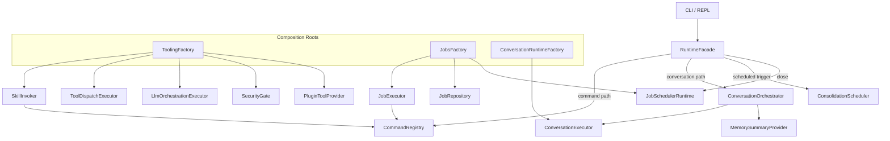

# Runtime Architecture V1

Status: Active  
Date: 2026-02-21  
Scope: runtime composition and orchestration boundaries after `RuntimeFacade` decomposition.

## 1. Goals

- Keep `RuntimeFacade` as a thin coordinator.
- Isolate construction/wiring in explicit composition roots.
- Preserve deterministic command envelopes and lifecycle behavior.

## 2. Component Topology

## 3. Ownership Boundaries

- `RuntimeFacade`:
  - parse/routing (`command` vs `conversation`)
  - per-session serialization boundary
  - turn recording
  - collaboration of conversation/memory/scheduler helpers
  - close/shutdown delegation
- `ConversationOrchestrator`:
  - persona/style resolution
  - conversation request shaping
  - response/error envelope mapping
- `MemorySummaryProvider`:
  - prompt-memory summary assembly
- `ConsolidationScheduler`:
  - interval decision and scheduled consolidation execution
- `ToolingFactory`:
  - skill invocation stack composition
  - tool providers and plugin security wiring
- `JobsFactory`:
  - jobs repository/executor composition
  - optional scheduler runtime build/start
- `ConversationRuntimeFactory`:
  - conversation executor composition
  - checkpointer-based default wiring

## 4. Runtime Build Contract

`RuntimeFacade` consumes `RuntimeDependencies` (composed) instead of constructing subsystems inline.

Build specs:
- `ToolingSpec`
- `JobsSpec`
- `ConversationRuntimeSpec`

Composed bundle:
- `RuntimeDependencies`

## 5. Invariants

- No command behavior change from decomposition alone.
- No policy semantic changes from decomposition alone.
- Lifecycle closes remain deterministic and idempotent.
- Scheduler runtime is only started when explicitly enabled.
