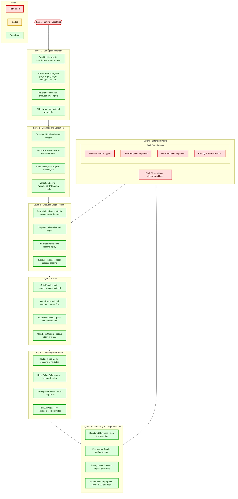

# Kernel layers and "things" to build

## Layer 0 — Storage and Identity

- [x] Run identity (run_id, timestamps, kernel version) — *Phase A done*
- [x] Artifact store — put_json, put_text, put_file, get, open_path, list; global SQLite index — *Phase B–D + put_text done*
- [x] Provenance metadata (producer, time, inputs) — in ArtifactRef and store
- [x] Minimal CLI — `lily run new` (+ optional `--work-order`); Typer + Rich; creates run dir + manifest, optionally attaches work order as file artifact — *done*

## Layer 1 — Contracts and Validation

- [x] Envelope model (universal typed wrapper)
- [x] ArtifactRef model (stable references + hashes) — *done in Layer 0 Phase B*
- [x] Schema registry (register artifact types)
- [x] Validation engine (Pydantic/JSONSchema hooks)

## Layer 2 — Execution Graph Runtime

- [x] Step model (inputs/outputs/executor/retry/timeout)
- [x] Graph model (nodes/edges)
- [x] Run state persistence (resume/replay)
- [x] Executor interface (local process + LLM later) — *done*

## Layer 3 — Gates

- [x] Gate model (inputs + runner + required/optional)
- [x] Gate runners (local command runner first)
- [x] Gate result model (pass/fail + reasons + logs)
- [x] Gate report persistence (logs capture + artifact refs)

## Layer 4 — Routing and Policies

- [x] Routing rules model (if fail → route) — *Phase 4.6 done*
- [x] Retry policy enforcement (bounded) — *Phase 4.6 done*
- [x] Workspace policies (allowlist/denylist paths) — *Phase 4.5 done*
- [x] Tool allowlist policy (what executors may run) — *Phase 4.4 done*

## Layer 5 — Observability and Reproducibility

- [x] Structured run logs (step timings, stdout/stderr)
- [x] Provenance graph (who produced what from what)
- [x] Replay controls (rerun step N, gates-only)
- [x] Snapshot metadata (env fingerprints, uv lock hash, etc.)
- [x] Artifact replacement (replace ID, record provenance, downstream reset)

## Layer 6 — Extension Points

- Plugin/Pack loader
- Pack contribution: schemas (artifact types)
- Pack contribution: step templates (optional)
- Pack contribution: gate templates (optional)
- Pack contribution: routing policies (optional)

